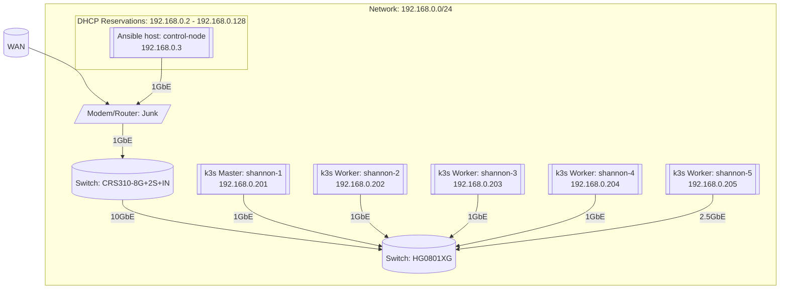
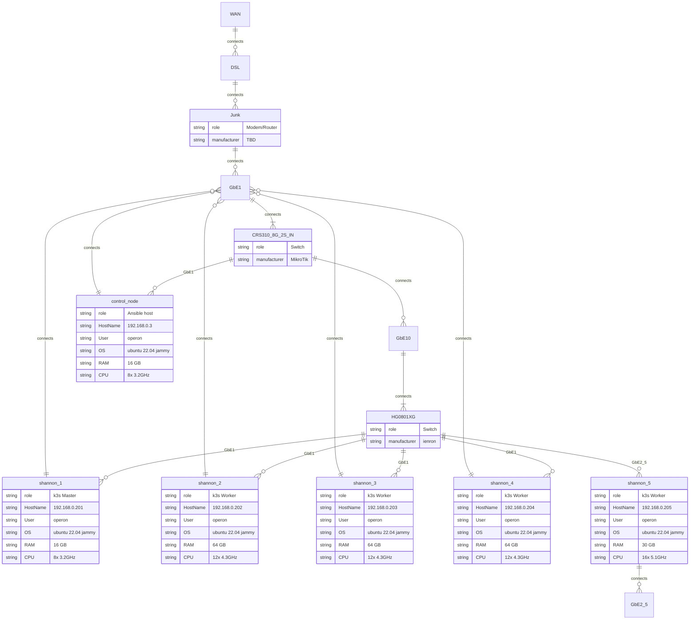

# Automated build of HA k3s Cluster with `kube-vip` and MetalLB


This playbook will build an HA Kubernetes cluster with `k3s`, `kube-vip` and MetalLB via `ansible`.

This is based on the work from [this fork](https://github.com/212850a/k3s-ansible) which is based on the work from [k3s-io/k3s-ansible](https://github.com/k3s-io/k3s-ansible). It uses [kube-vip](https://kube-vip.io/) to create a load balancer for control plane, and [metal-lb](https://metallb.universe.tf/installation/) for its service `LoadBalancer`.

If you want more context on how this works, see:

📄 [Documentation](https://technotim.live/posts/k3s-etcd-ansible/) (including example commands)

📺 [Watch the Video](https://www.youtube.com/watch?v=CbkEWcUZ7zM)


## ✅ System requirements

- Control Node (the machine you are running `ansible` commands) must have Ansible 2.11+ If you need a quick primer on Ansible [you can check out my docs and setting up Ansible](https://technotim.live/posts/ansible-automation/).

- You will also need to install collections that this playbook uses by running `ansible-galaxy collection install -r ./collections/requirements.yml` (important❗)

- [`netaddr` package](https://pypi.org/project/netaddr/) must be available to Ansible. If you have installed Ansible via apt, this is already taken care of. If you have installed Ansible via `pip`, make sure to install `netaddr` into the respective virtual environment.

- `server` and `agent` nodes should have passwordless SSH access, if not you can supply arguments to provide credentials `--ask-pass --ask-become-pass` to each command.

## Host & Network Information

### Infrastructure Graph

### Infrastructure Entity Relationship Graph

The inventory (`./inventory/shannon/hosts.ini`) is defined as follows:

```ini
# all hosts running Ubuntu 22.04 desktop
[master]
192.168.0.201

[node]
192.168.0.202
192.168.0.203
192.168.0.204
192.168.0.205

[k3s_cluster:children]
master
node
```

If multiple hosts are in the master group, the playbook will automatically set up k3s in [HA mode with etcd](https://rancher.com/docs/k3s/latest/en/installation/ha-embedded/).

We setup our `ansible.cfg` like so:
```ini
[defaults]
inventory = inventory/shannon/hosts.ini 
ansible_python_interpreter = ~/micromamba/bin/python3
remote_user = operon
private_key_file = ~/.ssh/id_rsa
host_key_checking = False
```
Setting `host_key_checking` to `False` is necessary to deal with `ssh` access 
between nodes. Otherwise, the  playbook will fail when running on fresh 
installs of Ubuntu 22.04 Desktop. I suspect that my use of Desktop instead of
server is behind some of my woes.

Lastly, we need to modify the `group_vars` for the k3s cluster. I changed 
three variables for my minimal configuration, although this is likely to
change, as I am slowly learning networking through sloppy grid search over
the parameter space.

```yaml
# Tim Notes:
# apiserver_endpoint is virtual ip-address which will be configured on 
# each master
## This is so multiple master nodes can present services as if it were one
## server at the apiserver_endpoint's virtual IP. 
## The control plane load balancer (kube-vip) manages the virtual IP 
## address and directs traffic to the master node that is best-suited 
## for the task.
##        
apiserver_endpoint: "192.168.0.200"
## Casey Notes:
## apiserver_endpoint must fall outside the metal_lb_ip_range
## metal_lb_ip_range set to addr outside of DHCP reservation range. 
metal_lb_ip_range: "192.168.0.130-192.168.0.140"
## Moved k3s_token to ./inventory/shannon/group_vars/vault.yml
## k3s token must be strictly alphanumeric
```

### Create Cluster

Start provisioning of the cluster using the following command:

```bash
ansible-playbook playbooks/site.yml -i inventory/shannon/hosts.ini
```

After deployment control plane will be accessible via virtual ip-address which is defined in inventory/group_vars/all.yml as `apiserver_endpoint`

### Remove k3s cluster

```bash
ansible-playbook playbooks/reset.yml -i inventory/shannon/hosts.ini
```

>You should also reboot these nodes due to the VIP not being destroyed

## Kube Config

To copy your `kube config` locally so that you can access your **Kubernetes** cluster run:

```bash
scp debian@master_ip:/etc/rancher/k3s/k3s.yaml ~/.kube/config
```
If you get file Permission denied, go into the node and temporarly run:
```bash
sudo chmod 777 /etc/rancher/k3s/k3s.yaml
```
Then copy with the scp command and reset the permissions back to:
```bash
sudo chmod 600 /etc/rancher/k3s/k3s.yaml
```

You'll then want to modify the config to point to master IP by running:
```bash
sudo nano ~/.kube/config
```
Then change `server: https://127.0.0.1:6443` to match your master IP: `server: https://192.168.1.222:6443`

### 🔨 Testing your cluster

See the commands [here](https://technotim.live/posts/k3s-etcd-ansible/#testing-your-cluster).

### Troubleshooting

Be sure to see [this post](https://github.com/techno-tim/k3s-ansible/discussions/20) on how to troubleshoot common problems

### Testing the playbook using molecule

This playbook includes a [molecule](https://molecule.rtfd.io/)-based test setup.
It is run automatically in CI, but you can also run the tests locally.
This might be helpful for quick feedback in a few cases.
You can find more information about it [here](molecule/README.md).

### Pre-commit Hooks

This repo uses `pre-commit` and `pre-commit-hooks` to lint and fix common style and syntax errors.  Be sure to install python packages and then run `pre-commit install`.  For more information, see [pre-commit](https://pre-commit.com/)

## 🌌 Ansible Galaxy

This collection can now be used in larger ansible projects.

Instructions:

- create or modify a file `collections/requirements.yml` in your project

```yml
collections:
  - name: ansible.utils
  - name: community.general
  - name: ansible.posix
  - name: kubernetes.core
  - name: https://github.com/techno-tim/k3s-ansible.git
    type: git
    version: master
```

- install via `ansible-galaxy collection install -r ./collections/requirements.yml`
- every role is now available via the prefix `techno_tim.k3s_ansible.` e.g. `techno_tim.k3s_ansible.lxc`

## Thanks 🤝

This repo is really standing on the shoulders of giants. Thank you to all those who have contributed and thanks to these repos for code and ideas:

- [k3s-io/k3s-ansible](https://github.com/k3s-io/k3s-ansible)
- [geerlingguy/turing-pi-cluster](https://github.com/geerlingguy/turing-pi-cluster)
- [212850a/k3s-ansible](https://github.com/212850a/k3s-ansible)
